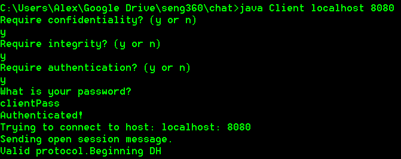
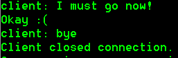

# Secure Chat Client

The secure chat client utilizes features only included in java 8, please upgrade if you are on 1.7 or lower.

#### 1. Purpose
This code repository implements a secure instant message system between a client and server program. 
#### 2. Security Requirements
The following requirements can be enabled/disabled in instructions 3 and 6 (see section 3). 

##### 2.1 Confidentiality
Confidentiality is ensuring that information is secure during transfer.
###### 2.1.1 Key Establishment

If the server and client have both selected integrity, confidentiality or both, the client and server begin establishing a symmetric key pair amongst themselves to be used for AES encryption/decryption as well as the generation of message authentication codes.The key establishment is done via the Diffie Hellman key establishment protocol, implemented using the Java Crypto library. This protocol uses properties of modular arithmetic to establish a symmetric key between two parties without broadcasting the key over the network. This is done using public values p and g, secret values a and b for each of the parties respectively and the property ((ga mod p)b mod p) = ((gb mod p)a mod p). This means both parties can compute the key, without sending a or b across. First each party computes (gmySecret mod p) and sends it to the other. Now each party has (gothersSecret mod p) and can perform ((gothersSecret mod p)mySecret mod p) resulting in the same key for both parties without ‘mySecret’ or ‘othersSecret’ being relayed. The technical sequence of these events can be found in Section 5.

###### 2.1.2 Encryption and Decryption

The confidentiality property is achieved by encrypting messages on the sending side and decrypting on the receiving side between the client and server communication using AES CBC mode. This requirement is implemented using the Java.crypto and Java.security libraries along with the symmetric session key (see section 2.2.1). 

##### 2.2 Integrity
Integrity is ensuring data has not been tampered with during transfer.
###### 2.2.1 Message Authentication Codes

The integrity property is achieved by sending a message authentication code (MAC) with the message. A MAC is a one way hash of a message and is used in a similar way as a virtual checksum. The sender sends a MAC along with the original message. On the receiving end, the original message is hashed using the same algorithm and compared to the received MAC to ensure that data has not been tampered with. This requirement is implemented using the Java.crypto and Java.security libraries, using SHA-256. 

##### 2.3 Authentication
Authentication is ensuring the person sending data is who they say they are.
###### 2.3.1 Password Authentication

If the user selects the authentication security requirement, they will be prompted to enter their password in order to prove that they own the private key they intend to sign their messages with. This is done by storing the hash of the respective client/server password in the pass file contained in their private directories. Once the user enters their password, the value will be hashed using SHA-256 and compared with the hash contained inside their private directory.  In the real world this password would be used to authenticate that the user attempting to access the private key used in step 2 is who they say they are. This could be achieved by having a password protected directory/file which contains a private key. For the sake of this assignment, please assume that directories containing private hashes and keys are properly access controlled.

###### 2.3.2 Signing and Verification

Authentication is also enforced by sending a digital signature that is verified on the receiving end. A digital signature is made by creating a one way hash of a message and encrypting it with the sender's private key. It is verified on the receiving end by decrypting the signature with the sender’s public key, creating the hash of the original message, and comparing the two outcomes. This protocol ensures that the message could have only been sent by the owner of the public key used to decrypt the signature. This requirement is implemented using the Java.crypto and Java.security libraries. 

### 3. Instructions
1. Navigate to: `<root-to-directory>/Secure-Chat-Client`
2. Compile the program: `javac *.java`
3. Start the server: `java Server 8080`
4. You will be prompted to enable/disable the three security properties above
5. If authentication is enabled, you will be prompted for a password. Use: `serverPass`
	
6. Start the client: `java Client localhost 8080`
7. You will be prompted to enable/disable the three security properties above.
8. If authentication is enabled, you will be prompted for a password. Use: `clientPass`
9. If the security settings for the server/client do not match connection will fail

##### Failed protocol validation:
###### Client POV:

	
###### Server POV:

	
	

##### Successful protocol validation:
	
###### Client POV:
	
	
###### Server POV:
	
            
10. You can now send messages from client to server and vice versa, behind the scenes the security requirements above are used to ensure that the chosen settings are enforced. In this example, all sent messages are being encrypted, signed and checksummed. On the receiver's side, messages are being decrypted, the signature is being verified and the checksum is being compared.
	
###### Client POV: 

###### Server POV:

	

11. To safely close the connection from the client's side, type `bye` and send it to the server.

###### Client POV:

###### Server POV:
	
	
12. Repeat steps 6-11 to reconnect to the server.

###### Client POV:

###### Server POV:

	

### 4. Additional Technical Details
Additional details related to the client/server interaction
#### 4.1 Connection Establishment

Once the server has received an open session message, it verifies that the client has the same security protocol as the one chosen when the server was first started. This is done by having the client send a string containing "CIAN" each of which corresponds to confidentiality, integrity, authentication and none respectively. For example, if the server receives the string "CI" It checks if its own security requirements have confidentiality and integrity but not authentication. If the client's security requirements match the server's security requirements, their connection is successfully established.

#### 4.2 Communication

The IM application implements chat using Java's socket programming libraries. The server binds a socket to the specified port and then listens for connections on that socket. Once the client connects to the socket, the server creates a new client handler object and initializes it. The client handler object allows for the server to handle clients connecting and disconnecting without interrupting the server. Both the client and the server use two threads to communicate with each other. One thread is for reading from standard input and writing to the output stream of the socket, the other thread is for reading from the socket and printing to the console. The client and server are then able to send and receive messages simultaneously. Once the client is finished they can simple send the bye message and both the client and server will clean up properly.

#### 4.3 Message Formatting and Parsing

Because the client and server need to send not only the intended message, but also a signature as well as a message authentication code, there needs to be some sort of formatting and parsing mechanism. Once the sender has successfully gathered the necessary information(message,signature,mac) they will format the message by separating each piece of information with ;;;. Three semicolons were chosen because it is unlikely that a user will ever enter 3 semicolons in their normal message. Once the message is received, the value is parsed back into the Communications object which allows for easy access of the the authentication, integrity and confidentiality fields.

### 5. Sequence Diagrams

##### Authentication Feature Interaction: 

&nbsp;
The Authentication Feature Interaction diagram above displays the sequence of events, as they would occur, should the authentication security feature be required. The above diagram is a ‘happy case’ and as such, assumes the password entered is correct and that the protocols on both client and server match.

##### Diffie Hellman Key Establishment Interaction: 

&nbsp;
The Diffie Hellman Key Establishment Interaction diagram, shown on the previous page, displays the sequence of interactions between the client and server as they establish an asymmetric key for further communication. Steps 1-5 are covered in the previous diagram as well, but to summarize, these steps establish a connection between the server and client and ensure that the security protocols match on both. Steps 6 and 7 represent both the client and server calling their diffieHellman functions respectively. In step 8,  the client generates a KeyPair (private and public key) using an instance of ‘DH’ or DiffieHellman, with default parameters and then in 9 a KeyAgreement object, which is initialized using the private key from 8. This KeyAgreement object provides the functionality of a key agreement protocol using the specified algorithm (in our case, diffie hellman). In step 10, the client public key encoded is sent to the server. In steps 11-14 the server extracts the DH parameters stored in the client public key encoded, and generates its own KeyPair and KeyAgreement object (NOTE: the server KeyAgreement object is initialized using the server's private key). In step 15 the server then sends its own public key encoded to the client. After step 16, in which the client decodes the server's key, both the client and server are in a state where they have their own KeyPairs, generated using the same DH parameters as each other, as well as the public key of the other party. Step 17 and 18 represent the ‘next phase’ of this key agreement. The doPhase() is done on both server and client KeyAgreement objects, but it is done with the other’s public key. (i.e server does doPhase(clientPubKey)). The doPhase of both server and client, if everything is done correctly, should return the same shared secret, which can then be used as the asymmetric key for future communication. The public key sent across by the client in step 10 represents the public values p and g, where each of the parties private keys act as their respective secret a and b’s.
